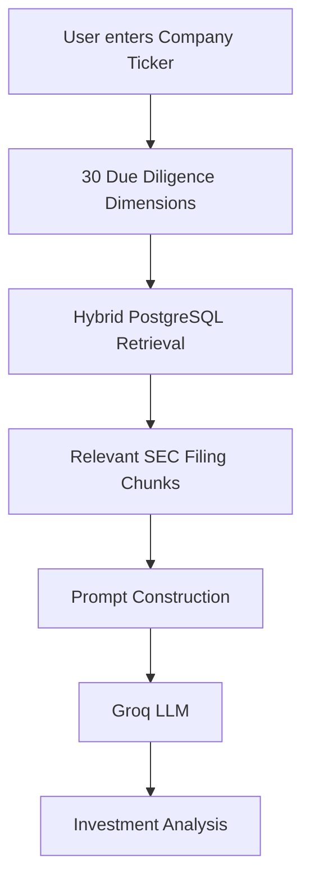
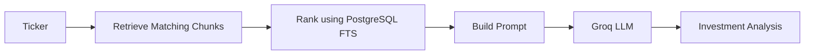
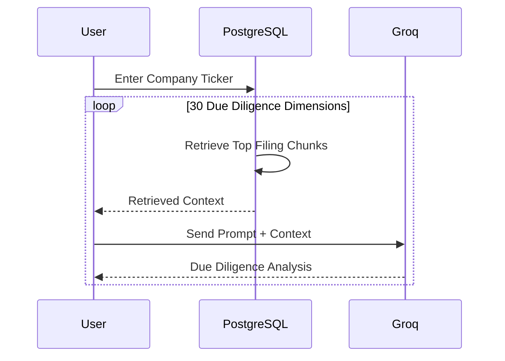
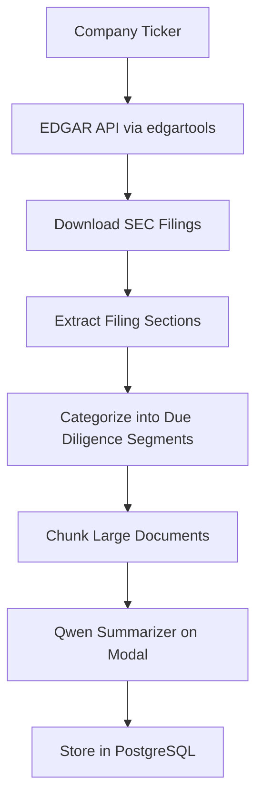
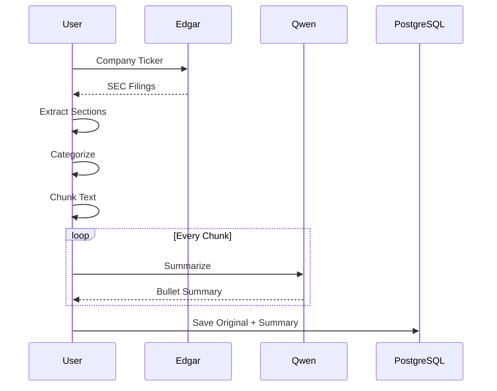
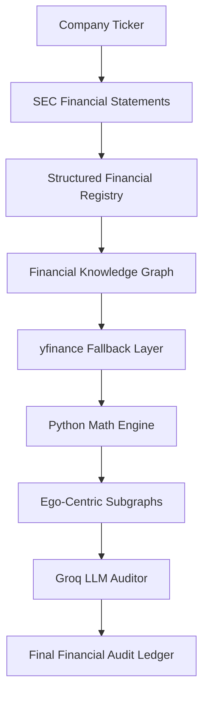
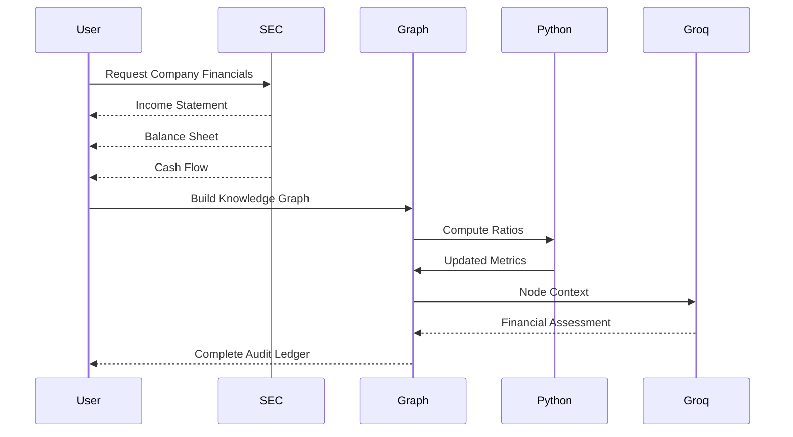
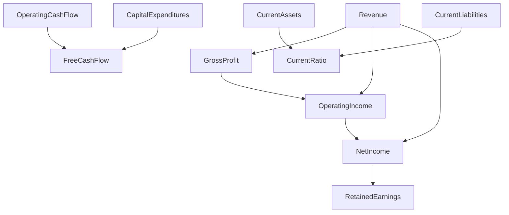

for narrative_analysis .py
# 📊 SEC Filing Hybrid Retrieval & Due Diligence Agent

An AI-powered **Retrieval-Augmented Generation (RAG)** system that performs **qualitative financial due diligence** on SEC filings stored in PostgreSQL.

Instead of sending an entire SEC filing to an LLM, the system first retrieves the most relevant filing sections using PostgreSQL Full-Text Search and then asks a Groq-hosted LLM to synthesize an investment-grade analysis.

---

# Architecture



---

# Project Goal

Financial analysts spend hours reading hundreds of pages of SEC filings to answer questions like:

- Does the company have pricing power?
- Are there governance concerns?
- Is management executing acquisitions effectively?
- What are the company's major supply chain risks?
- How concentrated are manufacturing facilities?
- Has management changed its risk narrative?

This project automates that workflow by:

1. Retrieving only the relevant filing sections.
2. Providing those sections to a Large Language Model.
3. Producing concise investment-focused due diligence reports.

---

# Features

- PostgreSQL Full-Text Search
- Hybrid keyword retrieval
- Context-aware prompt generation
- Groq GPT-OSS-120B integration
- 30 predefined investment due diligence dimensions
- SEC filing citation support
- Evidence-grounded responses
- Low hallucination design

---

# Folder Structure

```
project/
│
├── main.py
├── README.md
│
├── PostgreSQL
│     └── financial_due_diligence_chunks
│
└── Groq API
```

---

# Database Schema

The project expects a PostgreSQL table named

```
financial_due_diligence_chunks
```

Important columns:

| Column | Description |
|----------|------------|
| ticker | Company ticker |
| filing_date | SEC filing date |
| filing_type | 10-K, 10-Q etc. |
| sec_item | Filing section |
| original_chunk | Raw filing text |
| summary_bullet_points | Summary of chunk |

---

# Workflow



---

# How Retrieval Works

The retrieval engine searches both

- `original_chunk`
- `summary_bullet_points`

using PostgreSQL Full-Text Search.

Ranking is performed using

```sql
ts_rank_cd()
```

Search vectors are built using

```sql
to_tsvector()
```

Queries use

```sql
plainto_tsquery()
```

with an additional fallback

```sql
ILIKE
```

to capture partial matches.

---

# Retrieval Strategy

Each investment dimension contains two prompts.

## 1. Retrieval Statement

Designed specifically for PostgreSQL search.

Example

```
Pricing Power Execution:
How does management manage inflation?
```

Contains richer search vocabulary for better retrieval.

---

## 2. Due Diligence Question

Designed specifically for the LLM.

Example

```
Explain management's pricing strategy and customer elasticity.
```

Contains reasoning-oriented language.

Keeping retrieval and reasoning prompts separate improves overall accuracy.

---

# Execution Pipeline



---

# Main Components

## Configuration

Contains

- PostgreSQL credentials
- Groq API key
- model selection

---

## Hybrid Retrieval Engine

Function

```python
hybrid_db_retrieval()
```

Responsibilities

- Query PostgreSQL
- Rank SEC chunks
- Return highest scoring filing sections

---

## Prompt Builder

Creates structured context for the LLM.

Each retrieved document is formatted as

```
Context Document

Filed:
2024-09-30

Form:
10-K

Section:
Item 7

Executive Summary

...

Raw Filing Context

...
```

---

## Groq Generation

Function

```python
generate_diligence_analysis()
```

The LLM receives

- Due diligence question
- Retrieved SEC evidence
- Filing metadata

The model is instructed to

- cite filing dates
- cite SEC sections
- avoid hallucinations
- admit missing evidence
- remain objective

Temperature

```
0.15
```

is intentionally low for deterministic financial analysis.

---

# Due Diligence Dimensions

The project evaluates **30 qualitative investment dimensions**, including

- Strategic Moat
- Consumer Behavior
- Pricing Power
- Market Expansion
- M&A Integration
- FX Exposure
- Executive Compensation
- Human Capital
- Succession Planning
- Board Governance
- Related Party Transactions
- ESG Strategy
- Supply Chain Risk
- Manufacturing Concentration
- Procurement Risk
- Patent Exposure
- Vendor Lock-in
- Geopolitical Risk
- Litigation
- Data Privacy
- Environmental Liability
- Tax Risk
- Internal Controls
- Anti-Bribery Compliance
- Subsequent Events
- Risk Narrative Evolution
- Product Recalls
- Capital Allocation
- Debt Covenants
- Labor Relations

---

# Example Console Output

```
=========================================================
SEC Filing Hybrid Retrieval & Analysis Agent
=========================================================

Ticker:
AAPL

-----------------------------------------------

Dimension 12

Retrieved Chunks:
17

Analysis:

Management continues expanding pricing power while
maintaining stable customer demand.

Evidence:
2024-09-30
Item 7

...
```

---

# Technology Stack

| Component | Technology |
|------------|------------|
| Language | Python |
| Database | PostgreSQL |
| Retrieval | PostgreSQL Full-Text Search |
| API | Groq |
| LLM | GPT-OSS-120B |
| Driver | psycopg2 |

---

# Why This Architecture?

Instead of embedding entire SEC filings into vectors, this project uses PostgreSQL's built-in search engine.

Advantages

- No vector database required
- Fast retrieval
- Deterministic ranking
- Explainable search results
- Easy deployment
- Lower infrastructure cost

---

# Current Limitations

- No semantic vector retrieval
- Sequential processing
- No report export
- No confidence scoring
- Terminal-only interface
- Fixed 30 due diligence dimensions

---

# Future Improvements

- pgvector integration
- Hybrid BM25 + Embeddings retrieval
- Parallel execution
- PDF report generation
- HTML dashboard
- Confidence scoring
- Interactive UI
- Automatic SEC filing updates

---

# Design Philosophy

This project follows a **Retrieval-Augmented Generation (RAG)** architecture where:

- PostgreSQL serves as the retrieval engine.
- SEC filings act as the knowledge base.
- Groq performs qualitative reasoning.
- The LLM is constrained to retrieved evidence, minimizing hallucinations.

The objective is to automate institutional-quality financial due diligence while maintaining traceability to the original SEC filings.

----------------------------------------------------------------------------------------------------------------
the ingestion agent :
# 📥 SEC Filing Ingestion & Knowledge Base Builder

An automated SEC filing ingestion pipeline that downloads filings directly from the SEC EDGAR system, extracts important filing sections, summarizes them using a Qwen LLM hosted on Modal, and stores both the original text and summaries inside PostgreSQL for downstream Retrieval-Augmented Generation (RAG).

---

# Architecture



---

# Project Goal

Large SEC filings often contain hundreds of pages of disclosures.

Instead of storing entire filings as a single document, this pipeline prepares the filings for AI retrieval by:

- Downloading SEC filings
- Extracting important filing sections
- Organizing them into due diligence categories
- Chunking long documents
- Generating concise summaries
- Saving everything into PostgreSQL

The generated database becomes the knowledge base used by downstream Retrieval-Augmented Generation systems.

---

# Features

- Automatic SEC filing download
- Native section extraction using `edgartools`
- Due diligence segmentation
- Configurable text chunking
- AI-generated summaries via Qwen
- Batch PostgreSQL insertion
- Supports 10-K, 10-Q and DEF 14A filings
- Ready for RAG applications

---

# Architecture Overview



---

# Pipeline Workflow

```mermaid
flowchart LR

Ticker

--> Download Filings

--> Extract SEC Items

--> Categorize

--> Chunk

--> Summarize

--> Database
```

---

# Supported SEC Forms

The pipeline automatically downloads:

| Filing | Time Window |
|----------|------------|
| 10-K | Last 2 Years |
| 10-Q | Last 1 Year |
| DEF 14A | Last 1 Year |

---

# Extracted SEC Sections

The following sections are extracted from each filing:

| SEC Item | Description |
|----------|------------|
| Item 1 | Business |
| Item 1A | Risk Factors |
| Item 2 | Properties |
| Item 3 | Legal Proceedings |
| Item 7 | MD&A |
| Item 8 | Financial Statements |
| Item 9A | Internal Controls |

These sections provide the majority of qualitative information required for investment due diligence.

---

# Due Diligence Segmentation

Instead of storing SEC sections directly, they are reorganized into six business-focused categories.

| Segment | Typical Sources |
|-----------|----------------|
| Company & Operational Risks | Item 1A, Item 2, Item 9A |
| Supply Chain & Infrastructure Health | Item 1 |
| Consumer Health & Market Share | Item 1 |
| Legal & Regulatory Risks | Item 3 |
| Financial Performance & Solvency | Item 7, Item 8 |
| Corporate Governance & Structure | DEF 14A |

This allows downstream retrieval to search by business concepts rather than SEC filing structure.

---

# Text Chunking

Long filing sections are divided into smaller overlapping chunks before summarization.

Default configuration:

```python
Maximum Chunk Size : 4000 characters

Overlap            : 400 characters
```

Advantages:

- Better LLM context utilization
- Higher retrieval accuracy
- Reduced summarization latency

---

# AI Summarization

Each chunk is sent to a Qwen summarization model hosted on Modal.

```
Raw Filing Chunk

↓

Qwen Summarizer

↓

Executive Summary
```

Both the original text and summarized version are preserved.

---

# Database Schema

Each generated chunk is stored in

```
financial_due_diligence_chunks
```

Database columns

| Column | Description |
|---------|------------|
| ticker | Company ticker |
| cik | SEC company identifier |
| filing_type | 10-K, 10-Q, DEF 14A |
| filing_date | Filing date |
| segment_name | Due diligence category |
| sec_item | Original SEC item |
| original_chunk | Raw filing text |
| summary_bullet_points | AI generated summary |

---

# Main Components

## 1. Edgar Downloader

Responsible for

- Connecting to EDGAR
- Downloading filings
- Managing SEC rate limits automatically

Uses

```python
Company()
```

from the `edgartools` package.

---

## 2. Section Extractor

Uses

```python
extract_section()
```

instead of fragile regular expressions.

Advantages

- Native parsing
- Cleaner extraction
- Less maintenance
- Higher reliability

---

## 3. Due Diligence Mapper

Function

```python
categorize_to_due_diligence_segment()
```

Maps SEC filing sections into business-oriented investment categories.

---

## 4. Chunking Engine

Function

```python
chunk_text()
```

Splits large filing sections into overlapping chunks suitable for LLM processing.

---

## 5. AI Summarizer

Function

```python
call_qwen_summarizer()
```

Communicates with a Modal-hosted Qwen model and generates concise executive summaries.

---

## 6. Database Writer

Function

```python
save_chunks_to_db()
```

Uses PostgreSQL batch insertion for efficient storage.

---

## 7. Pipeline Orchestrator

Function

```python
run_ingestion_pipeline()
```

Coordinates the complete ETL workflow:

1. Download filings
2. Extract sections
3. Categorize
4. Chunk
5. Summarize
6. Store into PostgreSQL

---

# Example Pipeline Output

```
Initializing edgartools tracking for AAPL

Found 12 filings

Processing 10-K

Item 1

↓

Supply Chain & Infrastructure Health

↓

7 Chunks

↓

Summarized

↓

Stored

Processing Item 7

↓

Financial Performance

↓

12 Chunks

↓

Summarized

↓

Stored

...

Batch inserting 148 records...
```

---

# Technology Stack

| Component | Technology |
|------------|------------|
| Language | Python |
| SEC API | edgartools |
| Summarization | Qwen 7B |
| Inference | Modal |
| Database | PostgreSQL |
| Driver | psycopg2 |
| Batch Insert | execute_values |

---

# Design Philosophy

This pipeline is designed as the **knowledge ingestion layer** of a financial Retrieval-Augmented Generation system.

Instead of storing raw SEC filings directly, it transforms them into structured, searchable, and summarized knowledge units optimized for downstream AI analysis.

The architecture separates:

- Data acquisition
- Document structuring
- Semantic summarization
- Persistent storage

making the system scalable, modular, and reusable across multiple financial analysis applications.

---

# Future Improvements

- Parallel summarization of chunks
- Async database insertion
- Automatic incremental filing updates
- Duplicate detection
- Embedding generation (pgvector)
- Multi-model summarization support
- Retry queue for failed API calls
- Support for 8-K and S-1 filings

-------------------------------------------------------------------------------------------------------------------
# 🕸️ Financial Knowledge Graph & AI Audit Engine

A hybrid financial intelligence pipeline that transforms SEC financial statements into a **knowledge graph**, computes financial ratios deterministically using Python, enriches missing disclosures with **Yahoo Finance**, and performs node-level financial audits using a Large Language Model.

Unlike traditional financial analysis pipelines that send entire statements to an LLM, this system separates **mathematical computation** from **conceptual reasoning**, allowing deterministic financial calculations while leveraging AI only for interpretation.

---

# Architecture



---

# Project Goal

Traditional LLM-based financial analysis has several limitations:

- Models often hallucinate calculations.
- Ratios are recomputed inconsistently.
- Missing SEC disclosures create incomplete analyses.
- Entire financial statements consume unnecessary context.

This project addresses these issues by separating responsibilities:

- **Python performs all financial mathematics**
- **Knowledge Graph captures accounting relationships**
- **LLM performs qualitative reasoning only**

The result is a deterministic and explainable financial audit pipeline.

---

# Features

- SEC financial statement extraction
- Automatic taxonomy mapping
- Financial Knowledge Graph generation
- Deterministic ratio calculations
- Yahoo Finance fallback for missing metrics
- Ego-centric graph extraction
- Node-by-node AI financial audits
- Structured JSON audit reports

---

# System Pipeline



---

# High-Level Workflow

```mermaid
flowchart LR

Ticker

-->

SEC Financial Extraction

-->

Knowledge Graph

-->

Missing Data Recovery

-->

Financial Ratios

-->

Subgraph Extraction

-->

LLM Audit

-->

Audit Ledger
```

---

# Pipeline Overview

The pipeline executes six stages.

## Stage 1 — SEC Financial Extraction

Financial statements are downloaded directly using **edgartools**.

Extracted statements include:

- Income Statement
- Balance Sheet
- Cash Flow Statement

The latest reporting period is automatically detected.

---

## Stage 2 — Financial Registry Construction

Each statement is converted into a normalized long-form registry.

Example

| Concept | Date | Value |
|----------|------|------:|
| Revenue | 2024 | ... |
| Net Income | 2024 | ... |
| Assets | 2024 | ... |

Only valid disclosures are retained.

---

## Stage 3 — Knowledge Graph Construction

Instead of treating statements independently, every financial metric becomes a graph node.

Example

```text
Revenue
│
├── Gross Profit
│
├── Operating Income
│
└── Net Income
```

The graph captures accounting relationships between financial metrics.

---

# Canonical Financial Metrics

The graph currently models over **50 financial concepts**, including:

### Income Statement

- Revenue
- Gross Profit
- Operating Income
- Net Income
- R&D
- SG&A
- Interest Expense

### Balance Sheet

- Total Assets
- Current Assets
- Inventory
- Accounts Receivable
- Cash
- Goodwill
- Long-Term Debt
- Equity

### Cash Flow

- Operating Cash Flow
- Investing Cash Flow
- Financing Cash Flow
- Capital Expenditures
- Free Cash Flow

### Derived Ratios

- Gross Margin
- Operating Margin
- Net Profit Margin
- Current Ratio
- Debt-to-Equity
- Return on Assets
- Return on Equity

---

# Knowledge Graph Relationships

The graph contains deterministic accounting relationships.

Example



These relationships provide structural context for downstream AI reasoning.

---

# Taxonomy Mapping

SEC XBRL concepts vary across companies.

The pipeline maps multiple SEC concepts into standardized canonical metrics.

Example

| SEC Taxonomy | Canonical Metric |
|--------------|-----------------|
| Revenues | Revenue |
| SalesRevenueNet | Revenue |
| RevenueFromContractWithCustomerExcludingAssessedTax | Revenue |

This allows different companies to share a unified financial representation.

---

# Missing Data Recovery

Some companies omit certain disclosures.

A secondary recovery layer retrieves missing metrics from **Yahoo Finance**.

Recovered metrics include:

- Assets
- Revenue
- Equity
- Cash
- Operating Cash Flow
- Free Cash Flow
- Capital Expenditures

Recovered nodes are marked with

```
Disclosed (yfinance Fallback)
```

to preserve provenance.

---

# Deterministic Financial Engine

All financial ratios are calculated exclusively by Python.

Examples

```
Gross Margin

Gross Profit / Revenue
```

```
Current Ratio

Current Assets / Current Liabilities
```

```
Debt-to-Equity

Total Liabilities / Shareholders Equity
```

```
ROA

Net Income / Total Assets
```

```
ROE

Net Income / Equity
```

The LLM never performs financial calculations.

---

# Ego-Centric Graph Extraction

Instead of sending the entire graph to the LLM, only the neighborhood around a metric is extracted.

Example

```
Operating Income

↓

Revenue

↓

Operating Expenses

↓

Gross Profit
```

This minimizes context size while preserving structural information.

---

# AI Financial Auditor

Each graph node is independently evaluated using Groq.

The LLM receives

- metric value
- neighboring financial metrics
- graph structure

The model returns

```json
{
  "health_score": 9,
  "assessment": "...",
  "risk_flag": false
}
```

The prompt explicitly instructs the model:

- never perform calculations
- trust Python-derived ratios
- understand accounting semantics
- distinguish healthy cash outflows from financial distress

---

# Final Output

Every disclosed metric produces an audit record.

Example

```json
{
  "Revenue": {
    "value": 348000000000,
    "audit": {
      "health_score": 9,
      "assessment": "...",
      "risk_flag": false
    }
  }
}
```

The complete output forms a structured **Financial Audit Ledger**.

---

# Technology Stack

| Component | Technology |
|------------|------------|
| Language | Python |
| SEC Data | edgartools |
| Financial Data | Yahoo Finance |
| Knowledge Graph | NetworkX |
| Numerical Engine | NumPy |
| Data Processing | Pandas |
| LLM | Groq |
| Model | Llama 3.3 70B |

---

# Design Philosophy

The system follows a layered architecture where each component specializes in a single responsibility.

```
SEC

↓

Structured Financial Data

↓

Knowledge Graph

↓

Deterministic Math Engine

↓

Context Extraction

↓

LLM Reasoning

↓

Financial Audit
```

This separation ensures that:

- Python performs mathematics
- The graph captures accounting relationships
- The LLM provides conceptual interpretation

making the overall system more accurate, explainable, and scalable than a purely LLM-driven approach.

---

# Future Improvements

- Multi-period trend analysis
- Temporal knowledge graphs
- Peer-company comparison graphs
- Industry benchmark integration
- Graph Neural Networks (GNNs)
- Monte Carlo financial simulations
- Financial anomaly detection
- Interactive graph visualization
- Portfolio-level graph analytics
