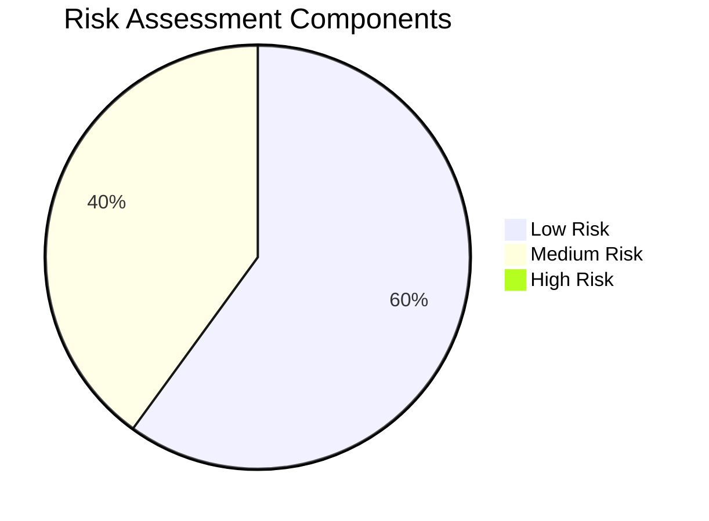
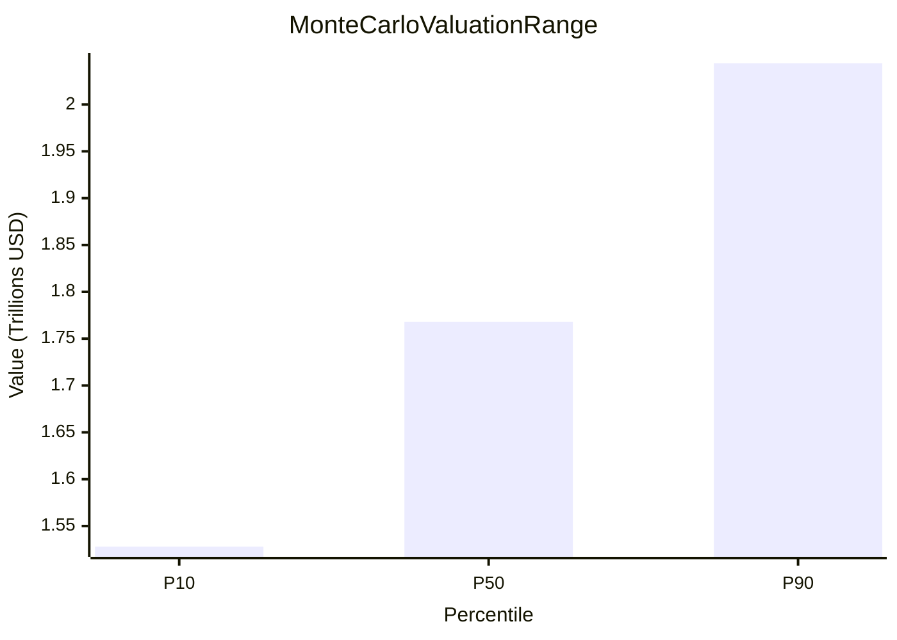

# Executive Summary

This report provides a comprehensive financial and risk assessment based on the supplied data. The company demonstrates strong financial health with exceptional profitability, evidenced by a high gross margin of 59.65%. Quantitative analysis indicates robust operational efficiency and strong pricing power.

The overall risk assessment categorizes the company as "HEALTHY (Low Risk Company)", supported by low probabilities of financial distress (Ohlson O Score) and a significant distance to default (Merton Distance to Default). While some metrics, such as Piotroski F Score and Beneish M Score, indicate a medium risk profile, the overall picture points to a stable financial position.

Valuation analysis, including deterministic DCF and Monte Carlo simulations, suggests a strong intrinsic value, with the median Monte Carlo valuation at $1.77 trillion. However, critical information regarding debt covenants and labor relations is currently unavailable, representing areas for further due diligence.

# Overall Risk Rating

**HEALTHY (Low Risk Company)**

# Investment Recommendation

Based on the "HEALTHY (Low Risk Company)" overall assessment, strong quantitative financial performance, and robust valuation metrics, a **Positive Investment Outlook** is recommended. Further investigation into the identified missing data points (debt covenants, labor relations) is advised to complete the risk profile.

# Business Overview

The provided data primarily focuses on financial metrics and risk assessments. A detailed narrative business overview is not available in the supplied information. However, the quantitative analysis highlights the company's exceptional profitability and operational efficiency, suggesting a strong market position and competitive moat.

# Quantitative Financial Analysis

The company exhibits strong financial performance, particularly in its core profitability metrics.

| Metric          | Value                 |
| :-------------- | :-------------------- |
| Revenue         | $402,836,000,000.00   |
| Cost of Revenue | $162,535,000,000.00   |
| Gross Profit    | $240,301,000,000.00   |
| Gross Margin    | 59.65%                |

---

### KPI Cards

**Revenue**
> **Value:** $402,836,000,000.00
> **Health Score:** 9/10
> The company demonstrates exceptional profitability with a 59.65% gross margin, indicating strong pricing power and operational efficiency. Its $240.3B gross profit relative to $402.8B revenue suggests a durable competitive moat.

**Cost of Revenue**
> **Value:** $162,535,000,000.00
> **Health Score:** 9/10
> The company demonstrates a strong moat with a high gross margin of 59.66%, indicating efficient operations and pricing power. The healthy GrossProfit relative to CostOfRevenue suggests robust profitability and operational efficiency.

**Gross Profit**
> **Value:** $240,301,000,000.00
> **Health Score:** 10/10
> GrossProfit aligns precisely with Revenue minus CostOfRevenue (402.8B - 162.5B = 240.3B). High 59.65% GrossMargin indicates strong operational efficiency and pricing power.

**Gross Margin**
> **Value:** 59.65%
> **Health Score:** 9/10
> The 59.65% gross margin indicates strong pricing power and operational efficiency, suggesting a durable competitive moat. The alignment between disclosed gross profit ($240.3B) and revenue ($402.8B) confirms structural consistency.

# Narrative Analysis

### Debt Covenants and Operational Flexibility

**Analysis Summary**

No specific text matches or relevant information was found regarding debt footnote provisions, financing lines agreements, or MD&A descriptions that detail negative covenants, operational flexibility caps, or leverage covenant limits.

**Missing Information**

The database lacks:
*   Debt footnote provisions
*   Financing lines agreements text
*   MD&A descriptions detailing:
    *   Negative covenants
    *   Operational flexibility caps
    *   Leverage covenant limits

**Conclusion**

A comprehensive analysis of the company's debt covenants, operational flexibility, and leverage limits is not possible with the provided data. Further review of SEC filings or additional sources is necessary.

### Union Organizing Activities, Collective Bargaining, and Labor Strike Exposures

**Analysis Summary**

After reviewing the provided SEC evidence from Alphabet's 2026 Proxy Statement (Form DEF 14A), no specific information was found regarding union organizing activities, ongoing collective bargaining renewal timetables, or potential labor strike exposures.

**Missing Information**

The provided context lacks data on labor relations, union activities, collective bargaining agreements, and potential labor disputes or strikes. This information is crucial for understanding the company's labor risk profile and potential exposures.

**Conclusion**

The provided SEC filings do not contain information on union organizing activities, collective bargaining renewal timetables, or potential labor strike exposures related to Alphabet.

# Risk Assessment

This section summarizes the risk profile based on various financial models.

### Severe Risks

> ⚠️ **No Severe Risks Identified.**
> Based on the provided risk model scores, no severe risks were flagged.

### Moderate Risks

> 🟧 **Piotroski F Score: 6 (MEDIUM_RISK)**
> A score of 6 indicates a medium risk profile, suggesting room for improvement in financial strength and fundamentals, though still generally positive.

> 🟧 **Beneish M Score: -2.29 (MEDIUM_RISK)**
> The Beneish M Score of -2.29 suggests a medium risk of earnings manipulation. While below the common threshold of -1.78 for high manipulation probability, it warrants attention.

### Low Risks

> ✅ **Ohlson O Score: 1.61e-05 (LOW_RISK)**
> An extremely low probability of financial distress, indicating strong solvency.

> ✅ **Merton Distance to Default: 10.84 (LOW_RISK)**
> A high distance to default, signifying a very low structural credit risk and strong ability to meet financial obligations.

> ✅ **DCF Risk: LOW_RISK**
> The uncertainty in the valuation distribution is assessed as low, indicating a relatively stable and predictable valuation outcome.

# Fraud Detection

This section presents key scores used for detecting potential financial manipulation and distress.

### Piotroski F Score

*   **Score:** 6
*   **Risk:** MEDIUM_RISK
*   **Interpretation:** The Piotroski F-Score is a discrete score between 0 and 9 that reflects the financial strength of a company. A higher score indicates strong financial strength and improving fundamentals. A score of 6 suggests a reasonably healthy financial position, but not exceptionally strong.

### Beneish M Score

*   **Score:** -2.288394335886238
*   **Risk:** MEDIUM_RISK
*   **Interpretation:** The Beneish M-Score is a statistical model that uses financial ratios to detect the probability of earnings manipulation. A score greater than -1.78 typically indicates a high probability of manipulation. The current score of -2.29 is below this threshold, suggesting a medium to low probability of manipulation, but still warrants monitoring.

### Ohlson O Score

*   **Score:** 1.6106963109748035e-05
*   **Risk:** LOW_RISK
*   **Interpretation:** The Ohlson O-Score is a model that predicts the probability of financial distress or bankruptcy within two years. A lower score indicates a lower probability of financial distress. The extremely low score here suggests a very low risk of financial distress.

### Merton Distance to Default

*   **Score:** 10.83569390757984
*   **Risk:** LOW_RISK
*   **Interpretation:** The Merton Distance to Default is a structural credit risk model that measures how many standard deviations a firm's asset value is away from its default point. A higher score indicates a greater distance from default, implying lower credit risk. A score of 10.84 signifies a very low probability of default.

# Valuation

The valuation analysis provides a range of intrinsic values for the company.

### Deterministic DCF Valuation

| Valuation Type      | Value                 |
| :------------------ | :-------------------- |
| Deterministic DCF   | $1,689,327,016,245.35 |

### Monte Carlo Simulation Valuation

| Valuation Percentile | Value                 |
| :------------------- | :-------------------- |
| P10 (Floor)          | $1,528,409,963,117.12 |
| P50 (Median)         | $1,768,169,466,187.69 |
| P90 (Ceiling)        | $2,044,376,864,280.30 |

### Valuation Comparison

| Valuation Method      | Value (USD)           |
| :-------------------- | :-------------------- |
| Deterministic DCF     | $1,689,327,016,245.35 |
| Monte Carlo P10       | $1,528,409,963,117.12 |
| Monte Carlo Median    | $1,768,169,466,187.69 |
| Monte Carlo P90       | $2,044,376,864,280.30 |

# Missing Data

The following critical information was not available in the provided dataset:

*   **Business Overview Narrative:** A comprehensive description of the company's operations, strategy, and market position.
*   **Debt Footnote Provisions:** Specific details on debt covenants, including negative covenants, operational flexibility caps, and leverage limits.
*   **Financing Lines Agreements Text:** Full text of agreements related to financing lines.
*   **MD&A Descriptions:** Management's Discussion and Analysis detailing debt covenants, operational flexibility, and leverage limits.
*   **Union Organizing Activities:** Information regarding any unionization efforts within the company.
*   **Collective Bargaining Renewal Timetables:** Details on ongoing collective bargaining agreements and their renewal schedules.
*   **Potential Labor Strike Exposures:** Assessment of risks related to potential labor disputes or strikes.

# Risk Flags

Based on the analysis, the following risk flags are highlighted:

*   **Accounting Concern (Information Gap):** Lack of detailed information on debt footnote provisions, financing lines agreements, and MD&A descriptions regarding negative covenants, operational flexibility caps, or leverage covenant limits. This absence prevents a full assessment of the company's financial flexibility and potential restrictions.
*   **Operational Concern (Information Gap):** Absence of data concerning union organizing activities, collective bargaining renewal timetables, and potential labor strike exposures. This gap limits the understanding of potential labor-related operational risks and their impact on business continuity.
*   **Manipulation Signal (Moderate):** The Beneish M Score of -2.29, while below the high manipulation threshold, indicates a medium risk of earnings manipulation, warranting continued vigilance.

# Visualizations

### Overall Risk Component Distribution

### Valuation Range (Monte Carlo Simulation)

