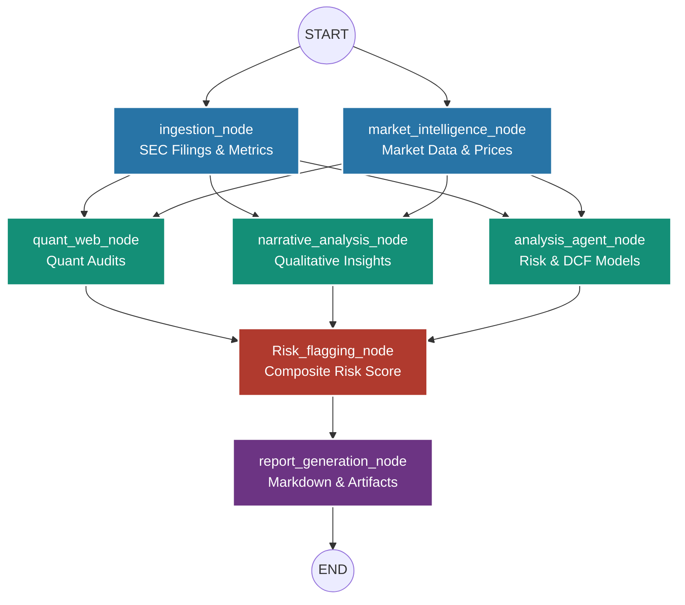

# The Wall Street DD - Backend Core

Welcome to the backend component of **The Wall Street DD**! This is an advanced, AI-powered financial due diligence pipeline that automates the comprehensive analysis of publicly traded companies. By orchestrating a multi-agent workflow, it performs quantitative valuation, qualitative narrative analysis, and risk assessment, returning detailed reports to the user.

## 🚀 Key Features

- **Automated Due Diligence Workflow**: Uses **LangGraph** to orchestrate multiple specialized AI agents (ingestion, analysis, charting, memo writing, etc.).
- **Real-Time Streaming API**: Built with **FastAPI**, it uses Server-Sent Events (SSE) to stream live progress of the analytical agents back to the frontend.
- **Comprehensive Artifact Generation**: Automatically generates professional artifacts for every analyzed ticker:
  - Markdown Reports (with Mermaid diagrams)
  - Microsoft Word Documents (`.docx`)
  - Excel DCF (Discounted Cash Flow) Valuation Models (`.xlsx`)
  - Chart Images (PNGs for KPI metrics, margins, risk radar, etc.)
- **Model Context Protocol (MCP)**: Includes a FastMCP server (`server.py`) exposing market intelligence tools like peer comparison and ratio extraction to external MCP clients.
- **Robust Financial Modeling**: Calculates intrinsic value via Monte Carlo DCF simulations and performs fraud/risk checks (Piotroski F-Score, Beneish M-Score, Ohlson O-Score, Merton Distance to Default).

## 🛠️ Technology Stack

- **Framework**: FastAPI (Python)
- **AI / Agentic Workflow**: LangGraph, Google GenAI (Gemini), Groq
- **Financial Data & APIs**: yfinance, edgartools, fredapi, Alpaca (for news)
- **MCP**: mcp, FastMCP
- **Data Science**: pandas, numpy, scikit-learn, networkx

## 📋 Prerequisites

- **Python 3.10+**
- API Keys for the AI models and data providers.

### Environment Variables
Create a `.env` file in the root of the `backend_core` directory and configure the following keys (based on your system requirements):

```env
# Required for the main analysis pipeline
GEMINI_API_KEY=your_google_gemini_key

# Other potential keys based on integrations
GROQ_API_KEY=your_groq_key
# ALPACA_API_KEY=... (If required for news fetching)
# ALPACA_SECRET_KEY=...
```

## ⚙️ Setup and Installation

1. **Navigate to the Backend Directory**:
   ```bash
   cd backend_core
   ```

2. **Create a Virtual Environment**:
   ```bash
   python -m venv venv
   ```

3. **Activate the Virtual Environment**:
   - **Windows**:
     ```powershell
     .\venv\Scripts\activate
     ```
   - **macOS/Linux**:
     ```bash
     source venv/bin/activate
     ```

4. **Install Dependencies**:
   ```bash
   pip install -r requirements.txt
   ```

## 🏃‍♂️ Running the Application Locally

### 1. The Main Due Diligence API (FastAPI)
This server runs the LangGraph workflows and serves the frontend.

```bash
uvicorn main:app --reload --host 0.0.0.0 --port 8000
```
- The API will be accessible at: `http://localhost:8000`
- API documentation (Swagger) is available at: `http://localhost:8000/docs`

### 2. The MCP Server (Optional)
If you want to run the standalone MCP (Model Context Protocol) server for market intelligence tools.

```bash
python server.py
```
*(By default, it will run an SSE transport MCP server on port 8000, or whatever is specified in the `PORT` env var).*

## 🔌 Core API Endpoints

- `GET /api/run-diligence?ticker={SYMBOL}`
  - **Description**: Triggers the entire LangGraph due diligence pipeline for a given stock ticker. Returns a Server-Sent Events (`text/event-stream`) stream containing node-by-node execution progress, and eventually the full markdown report, along with paths to the generated Word/Excel files.
- `GET /api/news?symbol={SYMBOL}`
  - **Description**: Fetches the latest relevant news for a given stock symbol using Alpaca.

## 📂 Output Artifacts Directory

When you run a due diligence report, the generated artifacts are automatically stored in the `outputs/{TICKER}/` directory. The FastAPI server statically mounts this directory so that the frontend can easily download or display the files:

- `outputs/{TICKER}/{TICKER}.md` (Markdown Summary)
- `outputs/{TICKER}/{TICKER}_due_diligence.docx` (Full Word Report)
- `outputs/{TICKER}/{TICKER}_dcf_model.xlsx` (Excel DCF Model)
- `outputs/{TICKER}/charts/` (Generated visualizations)

## 🏗️ Architecture & Data Flow

At the core of the backend is a state machine powered by **LangGraph**, defined in `masterlanggraph.py` and `nodes.py`. As the pipeline runs, an `AgentState` dictionary gets populated by different specialized agents, eventually culminating in a comprehensive final report.

### The LangGraph Workflow

The execution graph runs in parallel where possible to optimize speed. Here is the visual representation of the state machine and data flow:


```mermaid
graph TD
    START((START)) --> Ingestion[ingestion_node<br/>SEC Filings & Metrics]
    START --> MI[market_intelligence_node<br/>Market Data & Prices]
    
    Ingestion --> Quant[quant_web_node<br/>Quant Audits]
    MI --> Quant
    
    Ingestion --> Narrative[narrative_analysis_node<br/>Qualitative Insights]
    MI --> Narrative
    
    Ingestion --> Analysis[analysis_agent_node<br/>Risk & DCF Models]
    MI --> Analysis
    
    Quant --> Risk[Risk_flagging_node<br/>Composite Risk Score]
    Narrative --> Risk
    Analysis --> Risk
    
    Risk --> Report[report_generation_node<br/>Markdown & Artifacts]
    Report --> END((END))
    
    classDef initial fill:#2874A6,stroke:#fff,color:#fff,stroke-width:2px;
    classDef analysis fill:#148F77,stroke:#fff,color:#fff,stroke-width:2px;
    classDef risk fill:#B03A2E,stroke:#fff,color:#fff,stroke-width:2px;
    classDef report fill:#6C3483,stroke:#fff,color:#fff,stroke-width:2px;
    
    class Ingestion,MI initial;
    class Quant,Narrative,Analysis analysis;
    class Risk risk;
    class Report report;
```

#### 1. Initial Parallel Fetching
- `ingestion_node` (`ingestion_agent.py`): Ingests SEC filings and extracts structural financial metrics (Revenue, Income, Cash Flow, Balance Sheet data) using the `EdgarFinancialExtractor` (`quant_engine_metrics.py`).
- `market_intelligence_node` (`miagent_mcp.py`): Fetches real-time market metrics such as equity price, market capitalization, historical volatility, and macroeconomic indicators (e.g., risk-free rate, GNP deflator).

#### 2. Parallel Analysis Agents
*These agents wait for both initial nodes to complete before starting.*
- `quant_web_node` (`quant_web.py`): Executes quantitative audits and ledger validations.
- `narrative_analysis_node` (`consumer_analysis.py`): Uses LLMs to generate qualitative, narrative-driven insights about the company's prospects.
- `analysis_agent_node` (`analysis_agent.py`): Computes advanced financial health and fraud detection models, including the Piotroski F-Score, Beneish M-Score, Ohlson O-Score, Merton Distance to Default, and calculates Monte Carlo DCF valuations.

#### 3. Synthesis and Risk Evaluation
- `Risk_flagging_node`: Aggregates the results from the `analysis_agent` and categorizes the company's risk profile (LOW, MEDIUM, HIGH) across all models, outputting a composite `risk_report` and final verdict (e.g., "HEALTHY" or "STRESSED").

#### 4. Final Report Generation
- `report_generation_node` (`memo_agent.py`): The `memo_agent` takes the fully populated `AgentState` (including financials, narratives, and risk reports) and synthesizes the final professional Markdown report, and prepares the Word and Excel artifacts.

### Key Files

- `main.py`: The FastAPI entry point. It orchestrates the HTTP endpoints, streams the LangGraph execution events to the frontend via SSE, and saves the final outputs to disk.
- `server.py`: A FastMCP server exposing market intelligence tools to compatible MCP clients.
- `chart_generator.py`: Autonomously creates the matplotlib visualizations (margins, DCF waterfalls, risk radar) embedded in the final reports.
- `get_best_peer.py` & `get_ratios.py`: Utilities for fetching comparative competitor data and market ratios.
