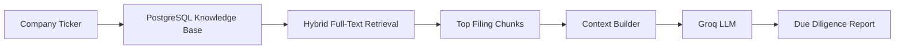

# 🔍 SEC Filing Hybrid Retrieval & Due Diligence Engine

An AI-powered qualitative due diligence engine that retrieves the most relevant SEC filing evidence from a PostgreSQL knowledge base and synthesizes investment-grade insights using **Groq LLMs**.

Instead of prompting an LLM with an entire SEC filing, this system first performs semantic retrieval over a structured database of filing chunks and summaries, then asks the LLM to reason only over the most relevant evidence. This retrieval-first approach significantly improves factual grounding, reduces hallucinations, and scales efficiently across large corporate disclosures.

---

# Overview

This pipeline serves as the **qualitative reasoning layer** of the financial due diligence platform.

It performs the following tasks:

1. Accepts a company ticker.
2. Searches a PostgreSQL knowledge base containing SEC filing chunks.
3. Retrieves the highest-ranked evidence for each investment dimension.
4. Constructs a structured context for the LLM.
5. Generates an evidence-based qualitative investment assessment.
6. Repeats the process across **30 independent due diligence dimensions**.

---

# Pipeline Architecture



---

# Features

- Retrieval-Augmented Generation (RAG)
- PostgreSQL Full-Text Search
- Hybrid Ranking using `ts_rank_cd`
- Fuzzy fallback using `ILIKE`
- Evidence-based LLM reasoning
- Filing date and SEC item citations
- Modular retrieval prompts
- Supports multiple SEC filing types
- Institution-style due diligence workflow

---

# System Workflow

```text
User enters ticker
        │
        ▼
Connect to PostgreSQL
        │
        ▼
Loop through 30 Due Diligence Dimensions
        │
        ▼
Retrieve Relevant Filing Chunks
        │
        ▼
Construct Prompt Context
        │
        ▼
Groq LLM Analysis
        │
        ▼
Print Investment Assessment
```

---

# Retrieval Process

The retrieval engine follows four distinct stages.

## Stage 1 — User Input

The user provides a ticker symbol.

Example

```text
AAPL
```

---

## Stage 2 — PostgreSQL Retrieval

The engine searches the table

```text
financial_due_diligence_chunks
```

using PostgreSQL Full-Text Search.

The search considers both

- Original SEC filing text
- AI-generated summary bullets

Ranking is performed using

```sql
ts_rank_cd()
```

If no semantic matches are found, the engine falls back to

```sql
ILIKE
```

to perform fuzzy keyword matching.

---

## Stage 3 — Context Construction

Every retrieved filing fragment is formatted into a structured context block.

Example

```text
Filed:
2024-10-30

Form:
10-K

Section:
Item 7

Executive Summary:
...

Raw Filing Context:
...
```

Multiple evidence blocks are concatenated into a single prompt for the LLM.

---

## Stage 4 — AI Due Diligence

The retrieved evidence is sent to Groq with a constrained system prompt instructing the model to

- reason only over retrieved evidence
- avoid hallucination
- cite filing metadata
- report missing information honestly

---

# Due Diligence Dimensions

The engine evaluates **30 independent qualitative dimensions**, including:

| Category | Example Questions |
|-----------|-------------------|
| Competitive Strategy | Competitive moat, disruption response |
| Consumer Behavior | Product mix changes, demand shifts |
| Pricing | Pricing power, inflation response |
| Growth | Expansion opportunities |
| M&A | Integration challenges |
| FX Risk | Currency adaptation |
| Executive Incentives | Compensation alignment |
| Human Capital | Labor relations, retention |
| Governance | Board oversight, succession planning |
| Related Parties | Governance conflicts |
| ESG | Environmental strategy |
| Supply Chain | Single-source dependencies |
| Manufacturing | Facility concentration |
| Procurement | Raw material risks |
| Intellectual Property | Patent strategy |
| Vendor Lock-in | SaaS migration barriers |
| Geopolitics | Tariffs and trade risks |
| Litigation | Active lawsuits |
| Privacy | GDPR, CCPA compliance |
| Environment | Remediation liabilities |
| Tax | Audit exposure |
| Internal Controls | Material weaknesses |
| Anti-Corruption | FCPA exposure |
| Subsequent Events | Post-period changes |
| Risk Factors | Evolution of disclosures |
| Product Safety | Recalls and investigations |
| Capital Allocation | Buybacks vs reinvestment |
| Debt Covenants | Operational restrictions |
| Labor Relations | Unionization and strikes |

---

# Database Schema

The retrieval engine expects a PostgreSQL table with the following structure.

| Column | Description |
|----------|-------------|
| ticker | Company ticker |
| cik | SEC company identifier |
| filing_type | 10-K, 10-Q, DEF 14A |
| filing_date | Filing submission date |
| segment_name | Due diligence category |
| sec_item | SEC filing section |
| original_chunk | Original filing text |
| summary_bullet_points | AI-generated summary |

---

# Retrieval Algorithm

The engine combines

## Semantic Search

```sql
to_tsvector()
```

↓

```sql
plainto_tsquery()
```

↓

```sql
ts_rank_cd()
```

---

## Keyword Fallback

```sql
ILIKE '%keyword%'
```

This hybrid strategy improves recall while maintaining relevance.

---

# Prompt Engineering

Each analysis consists of two prompts.

## Retrieval Statement

Optimized for database search.

Example

```text
Strategic Moat & Disruption
```

---

## Due Diligence Question

Optimized for reasoning.

Example

```text
Explain management's long-term competitive strategy.
```

Separating retrieval prompts from reasoning prompts significantly improves the quality of retrieved evidence.

---

# LLM Configuration

| Parameter | Value |
|-----------|-------|
| Provider | Groq |
| Model | GPT-OSS-120B |
| Temperature | 0.15 |
| Max Tokens | 1500 |

Low temperature ensures deterministic, evidence-based responses.

---

# Output Format

Each dimension produces a structured qualitative assessment.

Example

```text
Dimension:
Pricing Power

Evidence

• Item 7
• Filed 2024-10-30

Assessment

Management demonstrated strong pricing power through
incremental price increases while maintaining stable
customer demand.

Missing Information

No quantitative elasticity estimates disclosed.
```

---

# Execution Flow

```mermaid
flowchart TD

Start

-->

Input Ticker

-->

Connect PostgreSQL

-->

Retrieve Filing Evidence

-->

Construct Prompt

-->

Groq Analysis

-->

Print Report

-->

Next Dimension

-->

Complete
```

---

# Technology Stack

| Layer | Technology |
|---------|------------|
| Language | Python |
| Database | PostgreSQL |
| Search | PostgreSQL Full-Text Search |
| Driver | psycopg2 |
| AI | Groq |
| Model | GPT-OSS-120B |

---

# Design Philosophy

Traditional RAG systems often retrieve entire documents and expect the LLM to identify relevant information.

This engine instead follows a structured retrieval-first architecture:

```text
SEC Filing

        │

Chunking

        │

Database Storage

        │

Hybrid Retrieval

        │

Evidence Selection

        │

Groq Reasoning

        │

Due Diligence Report
```

By separating retrieval from reasoning, the system:

- reduces hallucinations
- improves factual grounding
- minimizes context size
- scales efficiently across large SEC filings
- produces explainable investment analyses

---

# Future Improvements

- Vector search using pgvector
- Hybrid BM25 + embeddings retrieval
- Cross-filing trend analysis
- Multi-company comparison
- Confidence scoring
- Citation highlighting
- Interactive web interface
- Export to PDF and HTML
- Analyst dashboard
- Portfolio-level due diligence reports

---

# Summary

The **SEC Filing Hybrid Retrieval & Due Diligence Engine** transforms a structured SEC filing knowledge base into an intelligent qualitative research assistant. By combining PostgreSQL hybrid retrieval with Groq-powered reasoning, it delivers evidence-based investment analysis across 30 institutional due diligence dimensions while maintaining transparency, scalability, and factual grounding.
