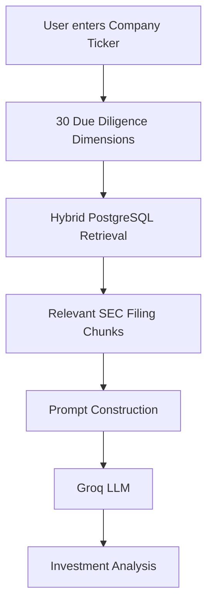
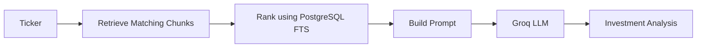
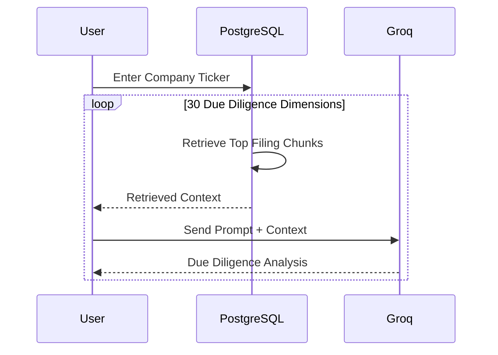

# 📊 SEC Filing Hybrid Retrieval & Due Diligence Agent

An AI-powered **Retrieval-Augmented Generation (RAG)** system that performs **qualitative financial due diligence** on SEC filings stored in PostgreSQL.

Instead of sending an entire SEC filing to an LLM, the system first retrieves the most relevant filing sections using PostgreSQL Full-Text Search and then asks a Groq-hosted LLM to synthesize an investment-grade analysis.

---

# Architecture



---

# Project Goal

Financial analysts spend hours reading hundreds of pages of SEC filings to answer questions like:

- Does the company have pricing power?
- Are there governance concerns?
- Is management executing acquisitions effectively?
- What are the company's major supply chain risks?
- How concentrated are manufacturing facilities?
- Has management changed its risk narrative?

This project automates that workflow by:

1. Retrieving only the relevant filing sections.
2. Providing those sections to a Large Language Model.
3. Producing concise investment-focused due diligence reports.

---

# Features

- PostgreSQL Full-Text Search
- Hybrid keyword retrieval
- Context-aware prompt generation
- Groq GPT-OSS-120B integration
- 30 predefined investment due diligence dimensions
- SEC filing citation support
- Evidence-grounded responses
- Low hallucination design

---

# Folder Structure

```
project/
│
├── main.py
├── README.md
│
├── PostgreSQL
│     └── financial_due_diligence_chunks
│
└── Groq API
```

---

# Database Schema

The project expects a PostgreSQL table named

```
financial_due_diligence_chunks
```

Important columns:

| Column | Description |
|----------|------------|
| ticker | Company ticker |
| filing_date | SEC filing date |
| filing_type | 10-K, 10-Q etc. |
| sec_item | Filing section |
| original_chunk | Raw filing text |
| summary_bullet_points | Summary of chunk |

---

# Workflow



---

# How Retrieval Works

The retrieval engine searches both

- `original_chunk`
- `summary_bullet_points`

using PostgreSQL Full-Text Search.

Ranking is performed using

```sql
ts_rank_cd()
```

Search vectors are built using

```sql
to_tsvector()
```

Queries use

```sql
plainto_tsquery()
```

with an additional fallback

```sql
ILIKE
```

to capture partial matches.

---

# Retrieval Strategy

Each investment dimension contains two prompts.

## 1. Retrieval Statement

Designed specifically for PostgreSQL search.

Example

```
Pricing Power Execution:
How does management manage inflation?
```

Contains richer search vocabulary for better retrieval.

---

## 2. Due Diligence Question

Designed specifically for the LLM.

Example

```
Explain management's pricing strategy and customer elasticity.
```

Contains reasoning-oriented language.

Keeping retrieval and reasoning prompts separate improves overall accuracy.

---

# Execution Pipeline



---

# Main Components

## Configuration

Contains

- PostgreSQL credentials
- Groq API key
- model selection

---

## Hybrid Retrieval Engine

Function

```python
hybrid_db_retrieval()
```

Responsibilities

- Query PostgreSQL
- Rank SEC chunks
- Return highest scoring filing sections

---

## Prompt Builder

Creates structured context for the LLM.

Each retrieved document is formatted as

```
Context Document

Filed:
2024-09-30

Form:
10-K

Section:
Item 7

Executive Summary

...

Raw Filing Context

...
```

---

## Groq Generation

Function

```python
generate_diligence_analysis()
```

The LLM receives

- Due diligence question
- Retrieved SEC evidence
- Filing metadata

The model is instructed to

- cite filing dates
- cite SEC sections
- avoid hallucinations
- admit missing evidence
- remain objective

Temperature

```
0.15
```

is intentionally low for deterministic financial analysis.

---

# Due Diligence Dimensions

The project evaluates **30 qualitative investment dimensions**, including

- Strategic Moat
- Consumer Behavior
- Pricing Power
- Market Expansion
- M&A Integration
- FX Exposure
- Executive Compensation
- Human Capital
- Succession Planning
- Board Governance
- Related Party Transactions
- ESG Strategy
- Supply Chain Risk
- Manufacturing Concentration
- Procurement Risk
- Patent Exposure
- Vendor Lock-in
- Geopolitical Risk
- Litigation
- Data Privacy
- Environmental Liability
- Tax Risk
- Internal Controls
- Anti-Bribery Compliance
- Subsequent Events
- Risk Narrative Evolution
- Product Recalls
- Capital Allocation
- Debt Covenants
- Labor Relations

---

# Example Console Output

```
=========================================================
SEC Filing Hybrid Retrieval & Analysis Agent
=========================================================

Ticker:
AAPL

-----------------------------------------------

Dimension 12

Retrieved Chunks:
17

Analysis:

Management continues expanding pricing power while
maintaining stable customer demand.

Evidence:
2024-09-30
Item 7

...
```

---

# Technology Stack

| Component | Technology |
|------------|------------|
| Language | Python |
| Database | PostgreSQL |
| Retrieval | PostgreSQL Full-Text Search |
| API | Groq |
| LLM | GPT-OSS-120B |
| Driver | psycopg2 |

---

# Why This Architecture?

Instead of embedding entire SEC filings into vectors, this project uses PostgreSQL's built-in search engine.

Advantages

- No vector database required
- Fast retrieval
- Deterministic ranking
- Explainable search results
- Easy deployment
- Lower infrastructure cost

---

# Current Limitations

- No semantic vector retrieval
- Sequential processing
- No report export
- No confidence scoring
- Terminal-only interface
- Fixed 30 due diligence dimensions

---

# Future Improvements

- pgvector integration
- Hybrid BM25 + Embeddings retrieval
- Parallel execution
- PDF report generation
- HTML dashboard
- Confidence scoring
- Interactive UI
- Automatic SEC filing updates

---

# Design Philosophy

This project follows a **Retrieval-Augmented Generation (RAG)** architecture where:

- PostgreSQL serves as the retrieval engine.
- SEC filings act as the knowledge base.
- Groq performs qualitative reasoning.
- The LLM is constrained to retrieved evidence, minimizing hallucinations.

The objective is to automate institutional-quality financial due diligence while maintaining traceability to the original SEC filings.

---

# License

This project is intended for educational and research purposes.
