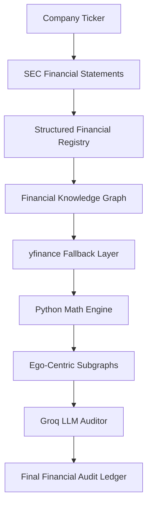
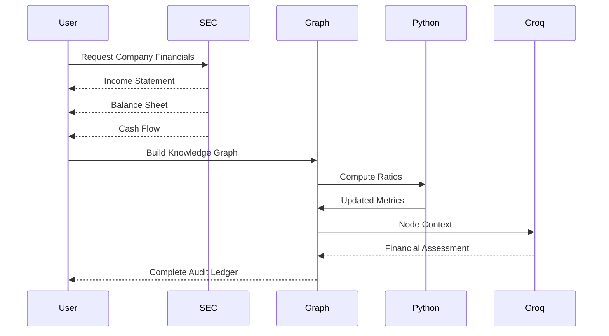
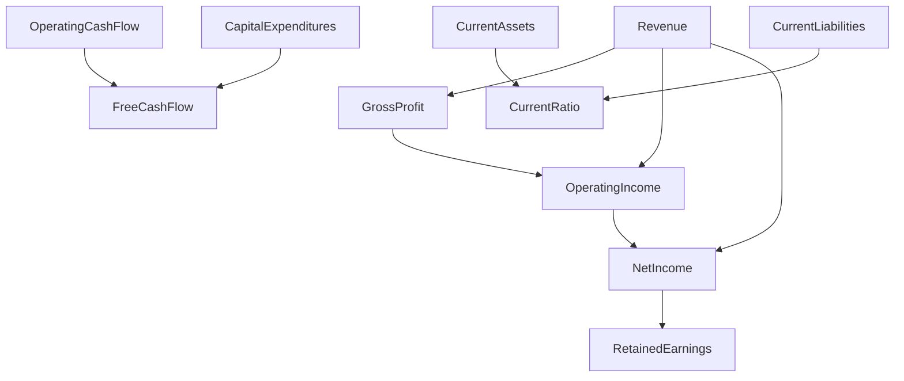

# 🕸️ Financial Knowledge Graph & AI Audit Engine

A hybrid financial intelligence pipeline that transforms SEC financial statements into a **knowledge graph**, computes financial ratios deterministically using Python, enriches missing disclosures with **Yahoo Finance**, and performs node-level financial audits using a Large Language Model.

Unlike traditional financial analysis pipelines that send entire statements to an LLM, this system separates **mathematical computation** from **conceptual reasoning**, allowing deterministic financial calculations while leveraging AI only for interpretation.

---

# Architecture



---

# Project Goal

Traditional LLM-based financial analysis has several limitations:

- Models often hallucinate calculations.
- Ratios are recomputed inconsistently.
- Missing SEC disclosures create incomplete analyses.
- Entire financial statements consume unnecessary context.

This project addresses these issues by separating responsibilities:

- **Python performs all financial mathematics**
- **Knowledge Graph captures accounting relationships**
- **LLM performs qualitative reasoning only**

The result is a deterministic and explainable financial audit pipeline.

---

# Features

- SEC financial statement extraction
- Automatic taxonomy mapping
- Financial Knowledge Graph generation
- Deterministic ratio calculations
- Yahoo Finance fallback for missing metrics
- Ego-centric graph extraction
- Node-by-node AI financial audits
- Structured JSON audit reports

---

# System Pipeline



---

# High-Level Workflow

```mermaid
flowchart LR

Ticker

-->

SEC Financial Extraction

-->

Knowledge Graph

-->

Missing Data Recovery

-->

Financial Ratios

-->

Subgraph Extraction

-->

LLM Audit

-->

Audit Ledger
```

---

# Pipeline Overview

The pipeline executes six stages.

## Stage 1 — SEC Financial Extraction

Financial statements are downloaded directly using **edgartools**.

Extracted statements include:

- Income Statement
- Balance Sheet
- Cash Flow Statement

The latest reporting period is automatically detected.

---

## Stage 2 — Financial Registry Construction

Each statement is converted into a normalized long-form registry.

Example

| Concept | Date | Value |
|----------|------|------:|
| Revenue | 2024 | ... |
| Net Income | 2024 | ... |
| Assets | 2024 | ... |

Only valid disclosures are retained.

---

## Stage 3 — Knowledge Graph Construction

Instead of treating statements independently, every financial metric becomes a graph node.

Example

```text
Revenue
│
├── Gross Profit
│
├── Operating Income
│
└── Net Income
```

The graph captures accounting relationships between financial metrics.

---

# Canonical Financial Metrics

The graph currently models over **50 financial concepts**, including:

### Income Statement

- Revenue
- Gross Profit
- Operating Income
- Net Income
- R&D
- SG&A
- Interest Expense

### Balance Sheet

- Total Assets
- Current Assets
- Inventory
- Accounts Receivable
- Cash
- Goodwill
- Long-Term Debt
- Equity

### Cash Flow

- Operating Cash Flow
- Investing Cash Flow
- Financing Cash Flow
- Capital Expenditures
- Free Cash Flow

### Derived Ratios

- Gross Margin
- Operating Margin
- Net Profit Margin
- Current Ratio
- Debt-to-Equity
- Return on Assets
- Return on Equity

---

# Knowledge Graph Relationships

The graph contains deterministic accounting relationships.

Example



These relationships provide structural context for downstream AI reasoning.

---

# Taxonomy Mapping

SEC XBRL concepts vary across companies.

The pipeline maps multiple SEC concepts into standardized canonical metrics.

Example

| SEC Taxonomy | Canonical Metric |
|--------------|-----------------|
| Revenues | Revenue |
| SalesRevenueNet | Revenue |
| RevenueFromContractWithCustomerExcludingAssessedTax | Revenue |

This allows different companies to share a unified financial representation.

---

# Missing Data Recovery

Some companies omit certain disclosures.

A secondary recovery layer retrieves missing metrics from **Yahoo Finance**.

Recovered metrics include:

- Assets
- Revenue
- Equity
- Cash
- Operating Cash Flow
- Free Cash Flow
- Capital Expenditures

Recovered nodes are marked with

```
Disclosed (yfinance Fallback)
```

to preserve provenance.

---

# Deterministic Financial Engine

All financial ratios are calculated exclusively by Python.

Examples

```
Gross Margin

Gross Profit / Revenue
```

```
Current Ratio

Current Assets / Current Liabilities
```

```
Debt-to-Equity

Total Liabilities / Shareholders Equity
```

```
ROA

Net Income / Total Assets
```

```
ROE

Net Income / Equity
```

The LLM never performs financial calculations.

---

# Ego-Centric Graph Extraction

Instead of sending the entire graph to the LLM, only the neighborhood around a metric is extracted.

Example

```
Operating Income

↓

Revenue

↓

Operating Expenses

↓

Gross Profit
```

This minimizes context size while preserving structural information.

---

# AI Financial Auditor

Each graph node is independently evaluated using Groq.

The LLM receives

- metric value
- neighboring financial metrics
- graph structure

The model returns

```json
{
  "health_score": 9,
  "assessment": "...",
  "risk_flag": false
}
```

The prompt explicitly instructs the model:

- never perform calculations
- trust Python-derived ratios
- understand accounting semantics
- distinguish healthy cash outflows from financial distress

---

# Final Output

Every disclosed metric produces an audit record.

Example

```json
{
  "Revenue": {
    "value": 348000000000,
    "audit": {
      "health_score": 9,
      "assessment": "...",
      "risk_flag": false
    }
  }
}
```

The complete output forms a structured **Financial Audit Ledger**.

---

# Technology Stack

| Component | Technology |
|------------|------------|
| Language | Python |
| SEC Data | edgartools |
| Financial Data | Yahoo Finance |
| Knowledge Graph | NetworkX |
| Numerical Engine | NumPy |
| Data Processing | Pandas |
| LLM | Groq |
| Model | Llama 3.3 70B |

---

# Design Philosophy

The system follows a layered architecture where each component specializes in a single responsibility.

```
SEC

↓

Structured Financial Data

↓

Knowledge Graph

↓

Deterministic Math Engine

↓

Context Extraction

↓

LLM Reasoning

↓

Financial Audit
```

This separation ensures that:

- Python performs mathematics
- The graph captures accounting relationships
- The LLM provides conceptual interpretation

making the overall system more accurate, explainable, and scalable than a purely LLM-driven approach.

---

# Future Improvements

- Multi-period trend analysis
- Temporal knowledge graphs
- Peer-company comparison graphs
- Industry benchmark integration
- Graph Neural Networks (GNNs)
- Monte Carlo financial simulations
- Financial anomaly detection
- Interactive graph visualization
- Portfolio-level graph analytics

---

# License

This project is intended for educational and research purposes.
